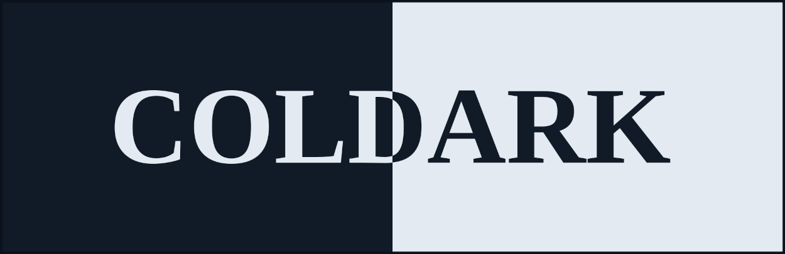
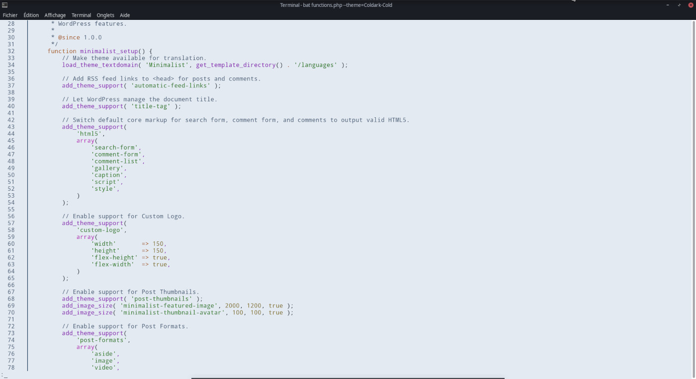
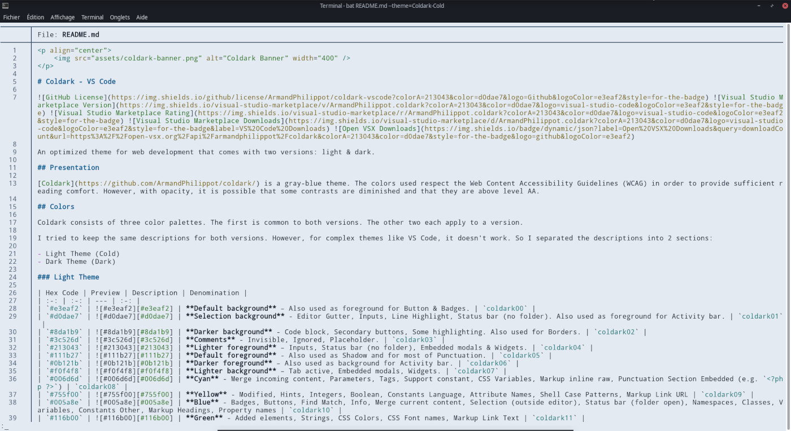
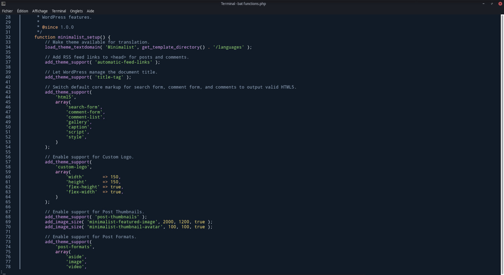
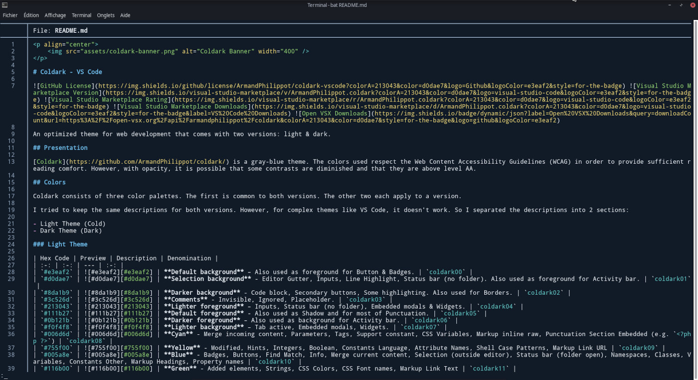

    

# Coldark - Bat

 

An optimized theme for web development that comes with two versions: light & dark.

## Presentation

[Coldark](https://github.com/ArmandPhilippot/coldark) is a gray-blue theme. The colors used respect the Web Content Accessibility Guidelines (WCAG) in order to provide sufficient reading comfort. However, with opacity, it is possible that some contrasts are diminished and that they are above level AA.

This Coldark version is designed for [bat](https://github.com/sharkdp/bat) command.

## Color pallets

Coldark consists of three color pallets. The first is common to both versions. The other two each apply to a version.

The `bat` version uses almost the same colors as [VS code version](https://github.com/ArmandPhilippot/coldark-vscode). The scopes seems a little different and a little less complete, hence the difference.

## Colors in detail

### Light Theme

| Hex Code | Preview | Description | Denomination |
| :-: | :-: | --- | :-: |
| `#e3eaf2` | ![#e3eaf2][#e3eaf2] | **Default background** – Also used as foreground for Button & Badges. | `coldark00` |
| `#d0dae7` | ![#d0dae7][#d0dae7] | **Selection background** - Editor Gutter, Inputs, Line Highlight, Status bar (no folder). Also used as foreground for Activity bar. | `coldark01` |
| `#8da1b9` | ![#8da1b9][#8da1b9] | **Darker background** - Code block, Secondary buttons, Some highlighting. Also used for Borders. | `coldark02` |
| `#3c526d` | ![#3c526d][#3c526d] | **Comments** - Invisible, Ignored, Placeholder. | `coldark03` |
| `#213043` | ![#213043][#213043] | **Lighter foreground** – Inputs, Status bar (no folder), Embedded modals & Widgets. | `coldark04` |
| `#111b27` | ![#111b27][#111b27] | **Default foreground** - Also used as Shadow and for most of Punctuation. | `coldark05` |
| `#0b121b` | ![#0b121b][#0b121b] | **Darker foreground** – Also used as background for Activity bar. | `coldark06` |
| `#f0f4f8` | ![#f0f4f8][#f0f4f8] | **Lighter background** – Tab active, Embedded modals, Widgets. | `coldark07` |
| `#006d6d` | ![#006d6d][#006d6d] | **Cyan** - Merge incoming content, Parameters, Tags, Support constant, CSS Variables, Markup inline raw, Punctuation Section Embedded (e.g. `<?php ?>`) | `coldark08` |
| `#755f00` | ![#755f00][#755f00] | **Yellow** - Modified, Hints, Integers, Boolean, Constants Language, Attribute Names, Shell Case Patterns, Markup Link URL | `coldark09` |
| `#005a8e` | ![#005a8e][#005a8e] | **Blue** - Badges, Buttons, Find Match, Info, Merge current content, Selection (outside editor), Status bar (folder open), Namespaces, Classes, Variables, Constants Other, Markup Headings, Property names | `coldark10` |
| `#116b00` | ![#116b00][#116b00] | **Green** - Added elements, Strings, CSS Colors, CSS Font names, Markup Link Text | `coldark11` |
| `#af00af` | ![#af00af][#af00af] | **Magenta** - Untracked elements, Token Expression value Support, Regular Expressions, Escape Characters, Constant Characters, Storage Modifiers, Instances, Markup List Punctuation, CSS values | `coldark12` |
| `#7c00aa` | ![#7c00aa][#7c00aa] | **Purple** - Unverified, Functions, CSS Classes & IDs | `coldark13` |
| `#a04900` | ![#a04900][#a04900] | **Orange** - Warnings, Status bar (debugging), Keywords, Storage, CSS Pseudo elements | `coldark14` |
| `#c22f2e` | ![#c22f2e][#c22f2e] | **Red** - Errors, Deleted, Invalids, Deprecated | `coldark15` |

### Dark Theme

| Hex Code | Preview | Description | Denomination |
| :-: | :-: | --- | :-: |
| `#111b27` | ![#111b27][#111b27] | **Default background** – Also used as foreground for Button & Badges. | `coldark00` |
| `#213043` | ![#213043][#213043] | **Selection background** - Editor Gutter, Embedded modals, Widgets, Line Highlight, Tab active. | `coldark01` |
| `#3c526d` | ![#3c526d][#3c526d] | **Light background** - Code block, Secondary buttons, Some highlighting. | `coldark02` |
| `#8da1b9` | ![#8da1b9][#8da1b9] | **Comments** - Invisible, Ignored, Placeholder. | `coldark03` |
| `#d0dae7` | ![#d0dae7][#d0dae7] | **Dark foreground** – Activity bar, Inputs, Status bar (no folder), Embedded modals & Widgets. | `coldark04` |
| `#e3eaf2` | ![#e3eaf2][#e3eaf2] | **Default foreground** - Also used for most of Punctuation. | `coldark05` |
| `#f0f4f8` | ![#f0f4f8][#f0f4f8] | **Lighter foreground** – Menu, Tab hover. | `coldark06` |
| `#0b121b` | ![#0b121b][#0b121b] | **Dark background** - Activity bar, Inputs, Status bar (no folder). Also used for Borders. | `coldark07` |
| `#66cccc` | ![#66cccc][#66cccc] | **Cyan** - Merge incoming content, Parameters, Tags, Support constant, CSS Variables, Markup inline raw, Punctuation Section Embedded (e.g. `<?php ?>`) | `coldark08` |
| `#e6d37a` | ![#e6d37a][#e6d37a] | **Yellow** - Modified, Hints, Integers, Boolean, Constants Language, Attribute Names, Shell Case Patterns, Markup Link URL | `coldark09` |
| `#6cb8e6` | ![#6cb8e6][#6cb8e6] | **Blue** - Badges, Buttons, Find Match, Info, Merge current content, Selection (outside editor), Status bar (folder open), Namespaces, Classes, Variables, Constants Other, Markup Headings, Property names | `coldark10` |
| `#91d076` | ![#91d076][#91d076] | **Green** - Added elements, Strings, CSS Colors, CSS Font names, Markup Link Text | `coldark11` |
| `#f4adf4` | ![#f4adf4][#f4adf4] | **Magenta** - Untracked elements, Token Expression value Support, Regular Expressions, Escape Characters, Constant Characters, Storage Modifiers, Instances, Markup List Punctuation, CSS values | `coldark12` |
| `#c699e3` | ![#c699e3][#c699e3] | **Purple** - Unverified, Functions, CSS Classes & IDs | `coldark13` |
| `#e9ae7e` | ![#e9ae7e][#e9ae7e] | **Orange** - Warnings, Status bar (debugging), Keywords, Storage, CSS Pseudo elements | `coldark14` |
| `#cd6660` | ![#cd6660][#cd6660] | **Red** - Errors, Deleted, Invalids, Deprecated | `coldark15` |

## Install

1. Install `bat` (on Manjaro: `pacman -S bat`)
2. Create themes folder: `mkdir -p "$(bat --config-dir)/themes"`
3. Go inside this new folder: `cd "$(bat --config-dir)/themes"`
4. Clone this repo: `git clone https://github.com/ArmandPhilippot/coldark-bat`
5. Update the binary cache: `bat cache --build`

Then, if you use `bat --list-themes`, you should see the themes.

Coldark Bat is now present in [bat repo](https://github.com/sharkdp/bat). It may be present in the list of themes in a future version without having to install it manually.

## Activation

To select one of the Coldark themes, call `bat` with the `--theme=Coldark-Cold` (or `--theme=Coldark-Dark`) option or set the `BAT_THEME` environment variable to `Coldark-Cold` (or `Coldark-Dark`). Use `export BAT_THEME="Coldark-Cold"` (or `export BAT_THEME="Coldark-Dark"`) in your shell's startup file to make the change permanent.

## Screenshots

Here are 2 rendering examples for each version.

### Cold

| PHP | Markdown |
| --- | --- |
|  |  |

### Dark

| PHP | Markdown |
| --- | --- |
|  |  |

## License

This project is open source and available under the [MIT License](https://github.com/ArmandPhilippot/coldark-bat/blob/master/LICENSE).

<!-- REFERENCES -->

<!-- UI Colors -->

[#f0f4f8]: https://placehold.it/20/f0f4f8/000000?text=+
[#e3eaf2]: https://placehold.it/20/e3eaf2/000000?text=+
[#d0dae7]: https://placehold.it/20/d0dae7/000000?text=+
[#8da1b9]: https://placehold.it/20/8da1b9/000000?text=+
[#3c526d]: https://placehold.it/20/3c526d/000000?text=+
[#213043]: https://placehold.it/20/213043/000000?text=+
[#111b27]: https://placehold.it/20/111b27/000000?text=+
[#0b121b]: https://placehold.it/20/0b121b/000000?text=+

<!-- Syntax - Light Theme Colors -->

[#c22f2e]: https://placehold.it/20/c22f2e/000000?text=+
[#116b00]: https://placehold.it/20/116b00/000000?text=+
[#755f00]: https://placehold.it/20/755f00/000000?text=+
[#005a8e]: https://placehold.it/20/005a8e/000000?text=+
[#af00af]: https://placehold.it/20/af00af/000000?text=+
[#006d6d]: https://placehold.it/20/006d6d/000000?text=+
[#7c00aa]: https://placehold.it/20/7c00aa/000000?text=+
[#a04900]: https://placehold.it/20/a04900/000000?text=+

<!-- Syntax - Dark Theme Colors -->

[#cd6660]: https://placehold.it/20/cd6660/000000?text=+
[#91d076]: https://placehold.it/20/91d076/000000?text=+
[#e6d37a]: https://placehold.it/20/e6d37a/000000?text=+
[#6cb8e6]: https://placehold.it/20/6cb8e6/000000?text=+
[#f4adf4]: https://placehold.it/20/f4adf4/000000?text=+
[#66cccc]: https://placehold.it/20/66cccc/000000?text=+
[#c699e3]: https://placehold.it/20/c699e3/000000?text=+
[#e9ae7e]: https://placehold.it/20/e9ae7e/000000?text=+
